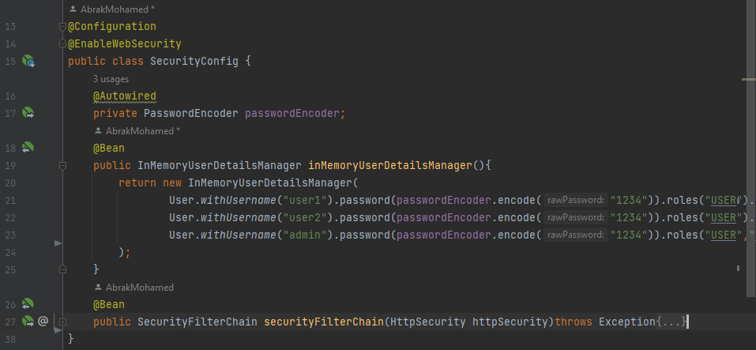
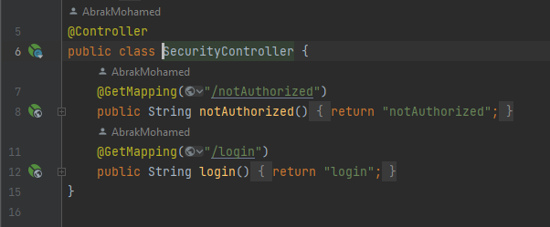
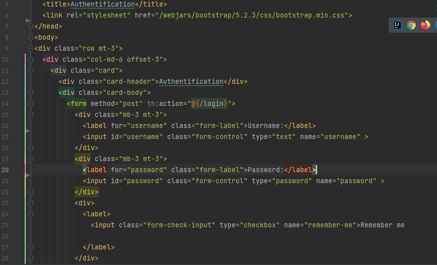
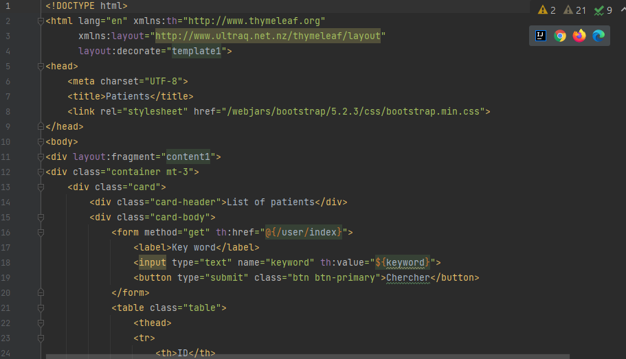
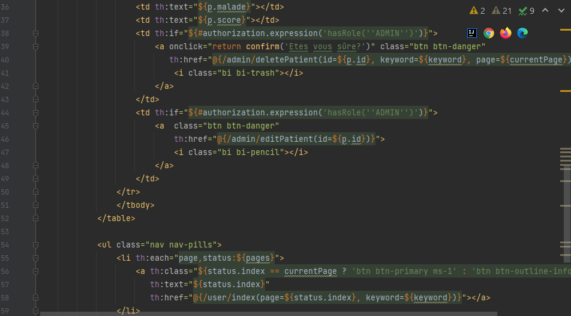
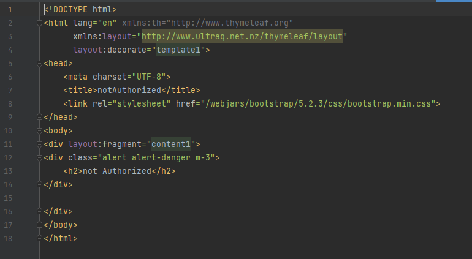

<h1>
Hospital App (MVC & Spring Security)</h1>

 
<h4>1- Login page</h4>

 
<h4>SecurityConfig.java</h4>

 
<h4>SecurityController.java</h4>

 
<h4>Login.html</h4>

 
<h4>2- Main page containing list of patients (ADMIN ACCOUNT)</h4>

 
<h4>patients.html</h4>

 

 
<h4>notAuthorized page</h4>

 
<h4>notAuthorized.html</h4>
